# PourMind app walkthrough

The education update was approved and published. [Open the live iPhone app](https://joshuamag1324.github.io/PourMind-App/).

[Download the mobile test package](https://raw.githubusercontent.com/JoshuaMag1324/PourMind-App/main/downloads/PourMind-iPhone-Test.zip). Extract it on a computer and follow `START_HERE.md` to run the included server. Use its address in your browser, or in Safari on an iPhone on the same Wi-Fi. Local-network HTTP supports the interactive features; full installation and offline use require HTTPS on the published HTTPS app.

These screenshots show the working app. The example journal observation is a demonstration, and the shared recipe is explicitly labelled as an example.

## Learning path

Five stages: beginner foundations, cocktail families, intentional substitutions, serving and finishing, then balance and original creation. All stages can be explored at your own pace. Lesson checks, guided reflections and practical exercises contribute to stage completion.

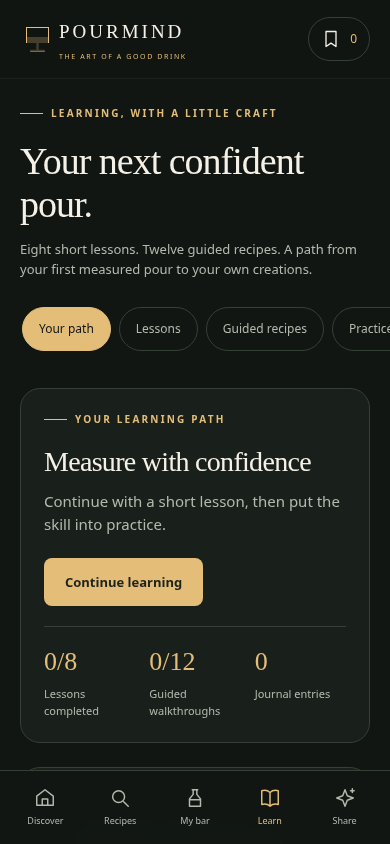

## Eight short lessons

Measure with confidence; shake to combine; stir for clarity; ice is an ingredient; flavor balance; ingredients and substitutions; cocktail families; glassware and finishing. Each lesson has three short sections, a knowledge check with feedback and a link to a relevant guided cocktail. The app remembers where you stopped.

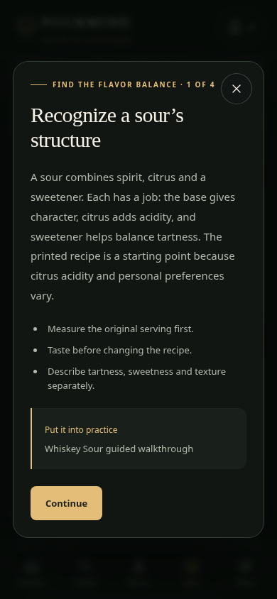

## Twelve guided recipes

Old Fashioned, Daiquiri, Negroni, Manhattan, Tom Collins, Margarita, Mojito, Whiskey Sour, Espresso Martini, Mai Tai, Boulevardier and Sidecar. Each walkthrough uses the reviewed measured recipe and explains why every step matters. Complete a reflection to save the walkthrough and a journal entry.

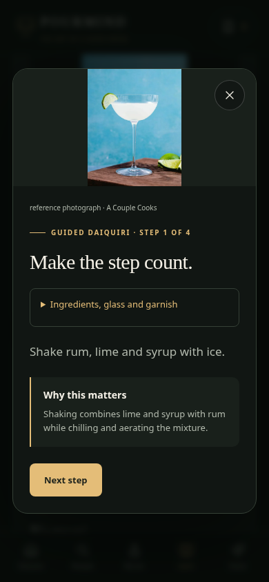

## Four practical exercises

Balance a sour, explore dilution, compare a base substitution, and design an original recipe. Exercises encourage changing one variable and recording its effect. Rehearsals with water and recipe-reading comparisons are supported.

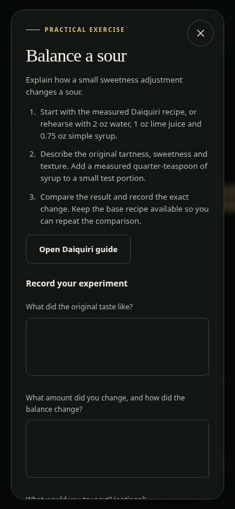

## Private learning journal

Guided reflections and experiments are saved on the device, including the observation, measured change and a next step. Notes can be exported as a JSON journal file or deleted. Storage failures are identified and entries are kept for the current visit.

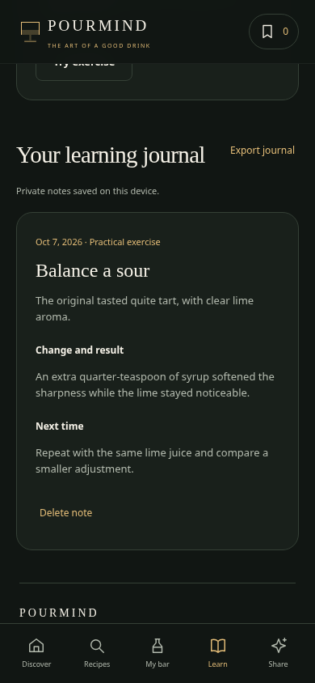

## Learn from other creators through recipe files

As selected, this version uses private drafts and file exchange. Create a measured recipe with a method, glass, garnish, teaching notes, inspiration, substitutions and an optional photo. The photo uploader requires ownership or permission confirmation.

Export a recipe file to share it. A friend imports it, records “I tried this” feedback, and returns the downloaded file. Importing that returned file merges new notes into the matching recipe without overwriting it or duplicating feedback. Changed recipes can be saved as separate variations. Saved recipes and imported recipes have collection filters.

Files include the supplied creator name, recipe, optional photo and feedback. Names are not verified accounts. Nothing is published automatically.

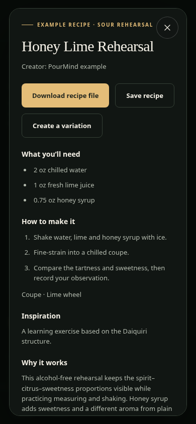

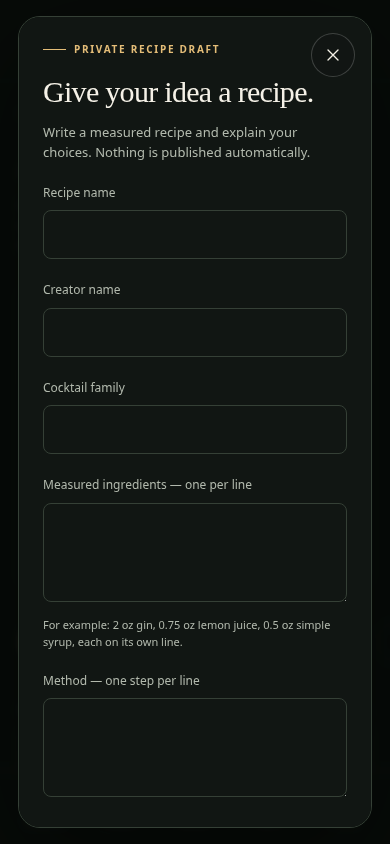

## Existing knowledge checks retained

The 30 questions remain available in their five topics and ten-question mixed practice. Progress from the original three-question quiz remains credited. The new lessons add their own eight checks.

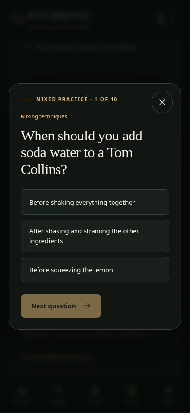

## Desktop layout

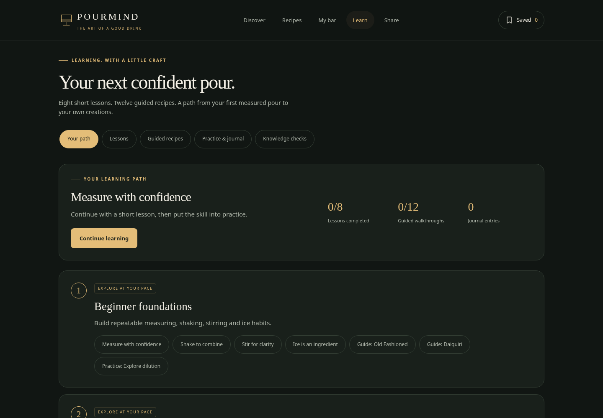

## Validation

- Every lesson, lesson check and guided recipe exercised in the browser.
- Four exercises, journal entries, resume state and learning stage completion verified.
- Two separate browser contexts tested draft export, import, feedback and return-file merging.
- Photo upload and ownership confirmation, measured ingredients, malformed files, unsupported image data and HTML-safe rendering checked.
- Offline access and persistence checked; layouts checked at 320, 390, 768 and 1440 pixels.
- Existing 30-question practice, legacy progress and favorites retained.

Approve this version to replace the live app, or request changes to the content or workflow.

## Cocktail families

Open Learn → Cocktail families. Search by family or drink name, then explore structure, mixing method, variations and the measured recipes. Fifteen groups cover all 86 library recipes.

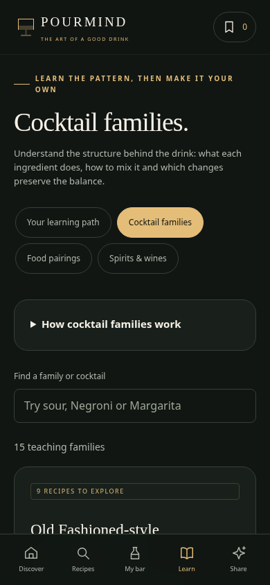
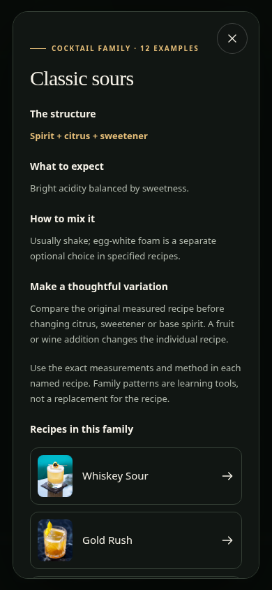

## Wines and spirits

Open My bar → Spirits & wines. Search or filter 244 entries: 118 whites, 110 reds, four rosés, five sparkling and seven fortified styles. Every entry includes its typical taste, body, acidity, sweetness, tannin, serving range and food ideas. Expand the tasting guide for definitions, or add a wine to your private bar. Choose Spirits for six distilled-spirit categories and their named styles.

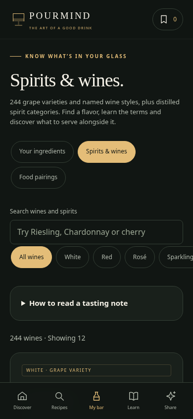
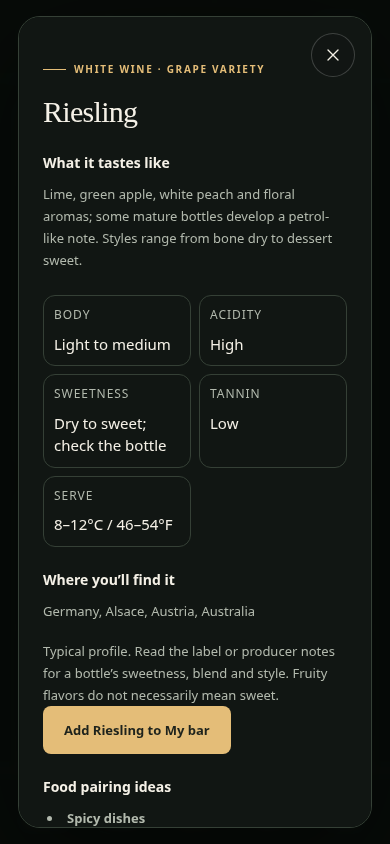

## Food pairings

Open Learn → Food pairings, choose a food group and switch between Wines and Cocktails. Every suggestion explains the match and opens the corresponding wine profile or measured cocktail recipe. Expand the pairing principles for guidance on acidity, tannin, sweetness and preparation.

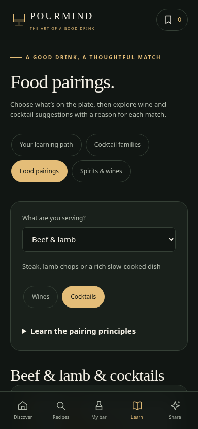
